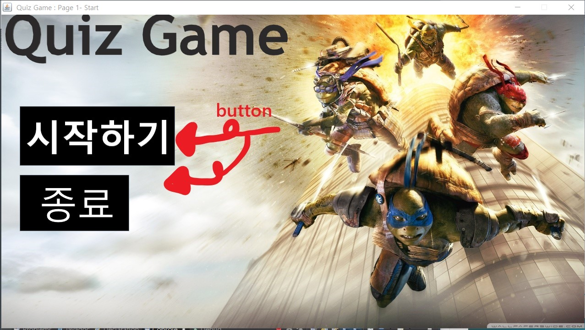
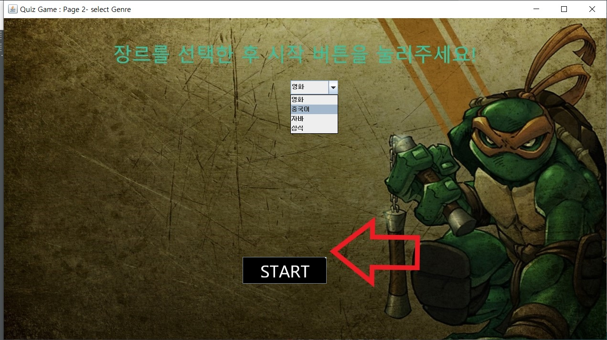
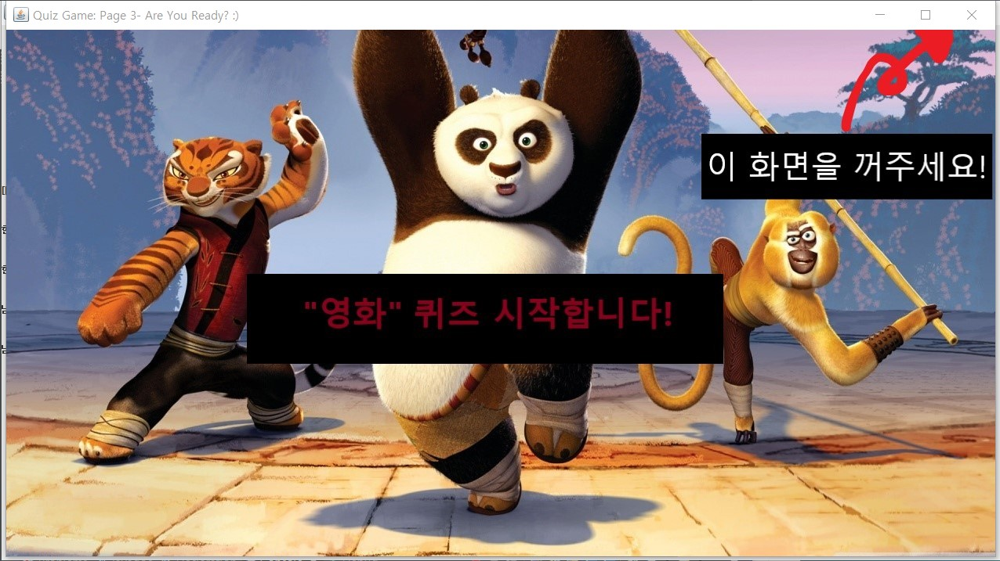
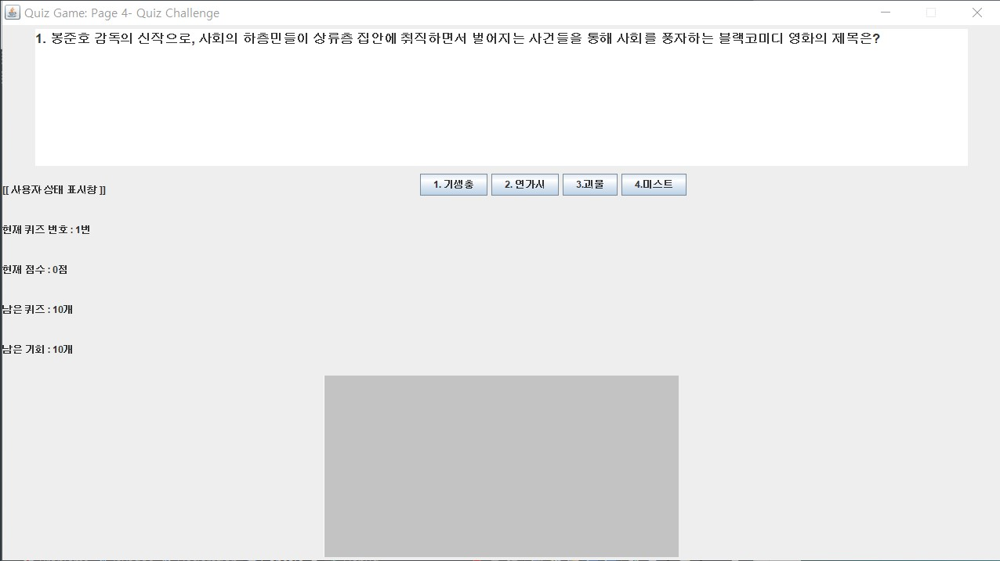
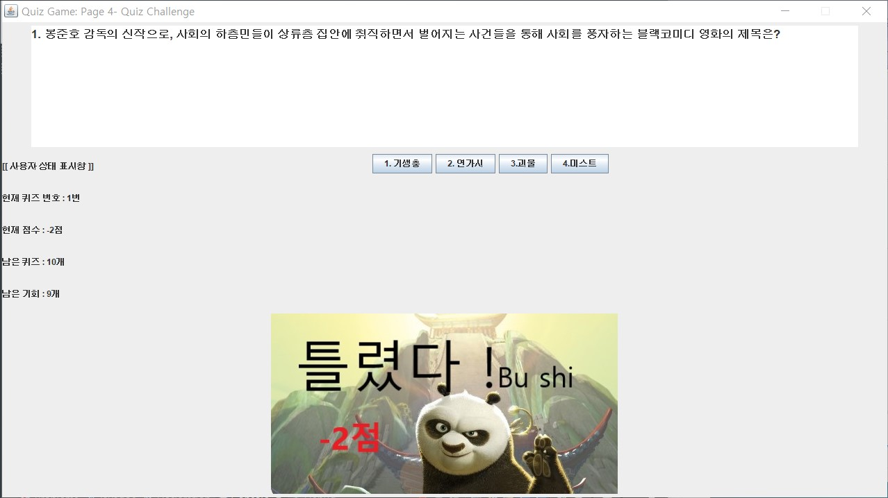
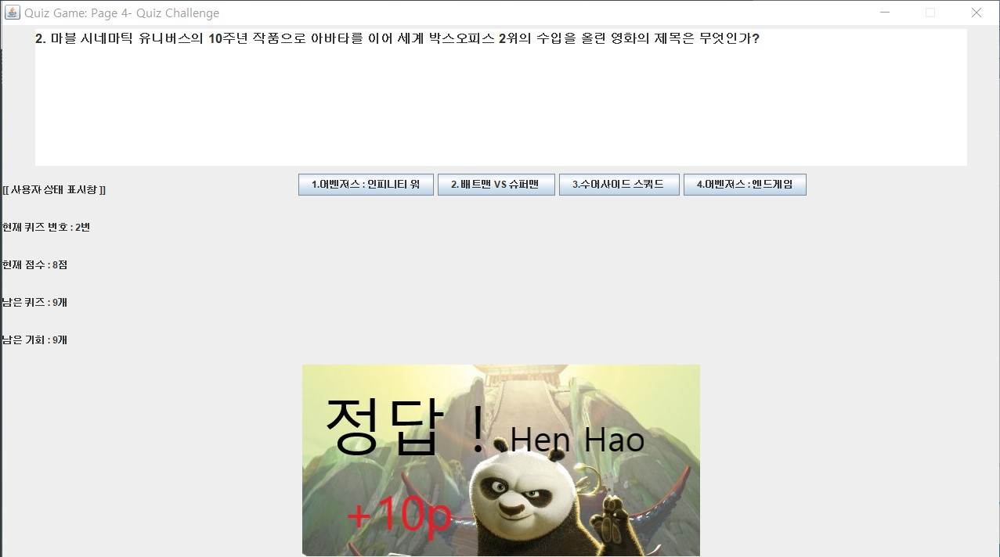
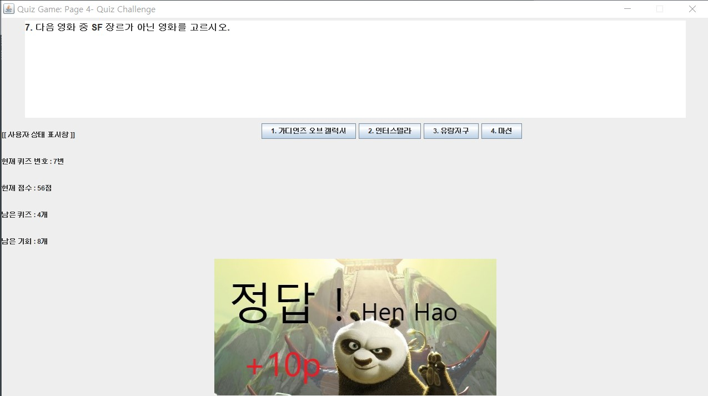
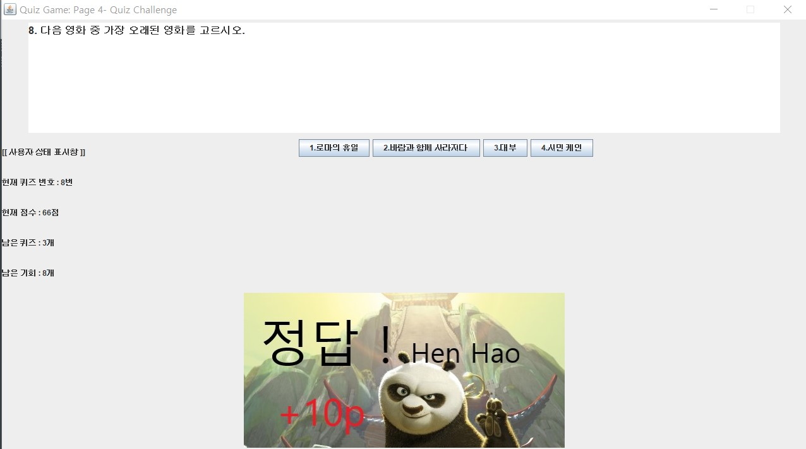
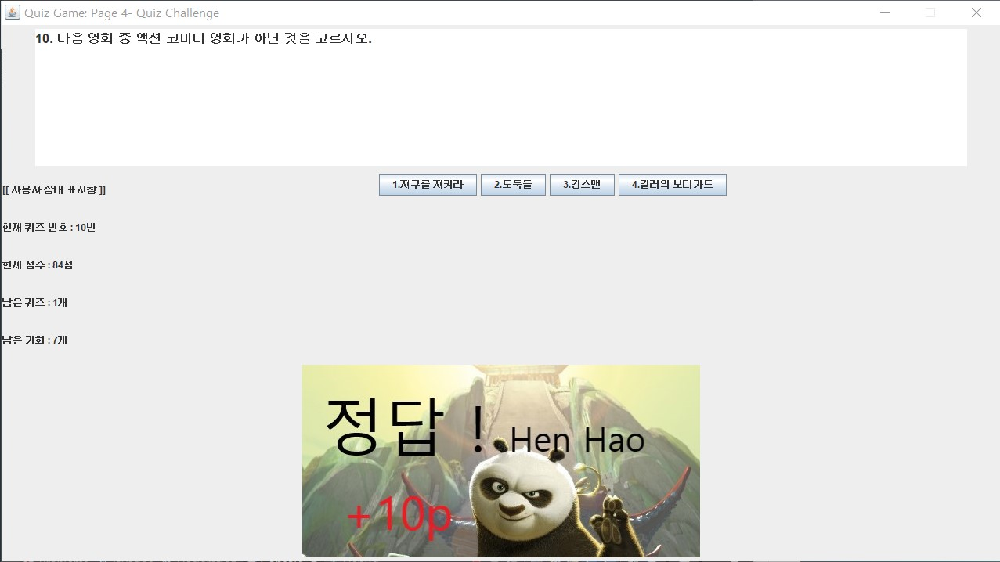
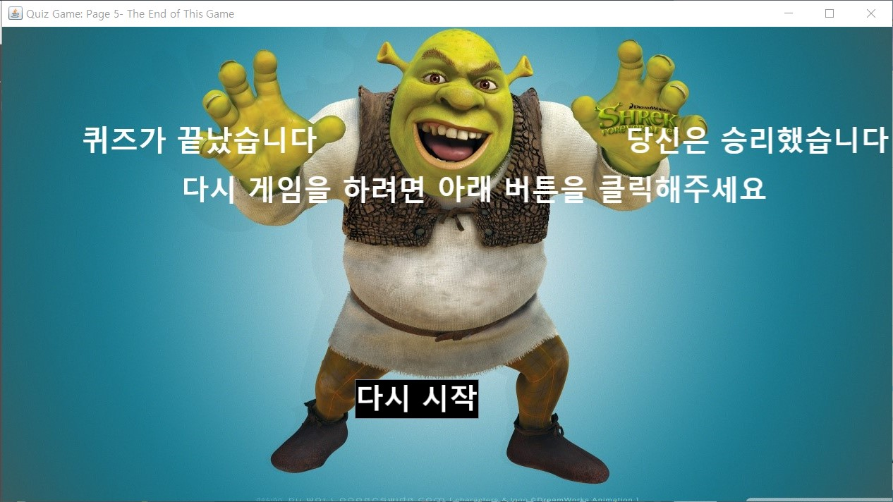

# [자바프로그래밍]QUIZGAME
- 프로젝트 주제: Java GUI 기반의 Quiz Game 프로젝트

- 수업정보 : 자바프로그래밍 경북대학교 전자공학부 이경숙 교수님

- 프로젝트 개발자: 전자공학부 15학번 이은찬, 전자공학부 15학번 김재국

This repository includes Java GUI projects which is made in KNU Java Programming.

---

## 프로그램 실행 방법

1. 이클립스를 실행합니다
2. 이클립스 상단 메뉴바의 File ->Open project from File System을 클릭합니다

 3. Import source 부분에 Directory... 버튼을 눌러
경로 상으로 이은찬_김재국>quizGame>quizGame인 폴더를 폴더 선택합니다
(이은찬_김재국-> quizGame ->quizGame 여기서 그 속의 quizGame 폴더를 선택 후 폴더선택 버튼)

 4. Finish를 클릭하여 Import Project 창을 빠져나옵니다
5.Package Explorer에 quizGame 패키지가 생겼을 것입니다

1. 패키지 속 src> quizGame >을 보시면 자바 코드가 8개 존재합니다
Main.java를 클릭하여 RUN 하면 프로그램이 정상 동작합니다

**주의**
폴더를 불러올 때 압축 푼 quizGame 내에 quizGame 폴더를 불러와야 정상 작동합니다
압축을 푼 quizGame 폴더를 바로 불러오면 프로그램 실행시 문제 화면에 글자가 안 나옵니다
혹여나 오류가 발생하는 경우에는 조장 연락처(010-3948-0530/이은찬)로 연락 주시면 감사하겠습니다.

---

## 프로그램 Overview 

1. [프로그램 실행 방법]대로 eclipse에서 Main.java를 Run하면 가장 먼저 게임의 시작화면이 아래와 같이 나옵니다. 게임시작 버튼을 눌러 다음화면으로 넘어갑니다. 앞으로 계속 화면의 페이지에 맡게 상단 바 이름이 계속 바뀌게 됩니다. 진짜 게임처럼 흥미를 돋우기 위해 만든 기능입니다.

2. 장르 선택 화면입니다. 퀴즈를 풀고싶은 장르를 선택하고 START를 눌러봅니다. 저는 **영화**를 선택해보겠습니다.

3. 영화 테마에 맞는 알림 페이지(Page 3-Are You Ready? :) )가 팝업처럼 뜨게됩니다. 준비가 되면 이 페이지를 끄면서 게임을 시작할 수 있습니다. 팝업 페이지를 꺼보겠습니다.

4. 장르에 맞는 문제가 출제됩니다. 중단에 버튼으로 구현한 객관식 보기와 좌측에 위치한 상태표시창, 하단에는 정답/오답 유무 판이 주어집니다.

5. 1번문제의 정답은 1번입니다만 2번을 누르고 난뒤 화면입니다. 상태판에 남은 기회와 점수가 감점되고 정답판에 틀렸다는 알림 이미지가 뜹니다. 

6. 1번 문제 정답을 눌러 맞추니, 문제출제판,보기판이 바로 바뀌고 정답판에 정답 이미지가 뜨며 상태판에 점수가 오르며 남은문제수가 10에서 9로 감소하였습니다.

7. 계속 문제를 맞추면서 10문제를 다 맞추고 게임이 끝날때 어떻게 처리되는지를 보여드리겠습니다.

8. 게임은 끝나게 되고 캐릭터와 함께 승리를 축하하는 화면이 나타납니다! 다시시작 버튼을 눌러보겠습니다.

9. 다시시작 버튼을 통해 다시 시작화면으로 돌아왔습니다. 여기까지가 준비된 게임 Overview의 전부입니다. 더 궁금하시다면 Eclipse를 통해서 [프로그램 실행 방법]을 참조해서 실행해보세요!! 누구나 즐길 수 있습니다.

**-이상 개발자 전자공학부 이은찬,김재국-**

---

## [프로젝트에 대한 소감문 작성]

### [주제]

**자바를 이용한 GUI 기반의 퀴즈 게임**

### [조원]

**1.경북대학교 전자공학부 이은찬 (조장)**

**2.경북대학교 전자공학부 김재국**

### [참여도 점수]

**김재국 10점**

**이은찬 9점**

(둘 다 고생했으나 동점을 부여할 수 없는 원칙이 있었음)

### [소감]

<조장 전자공학부 이은찬>

사실 이전부터 프로그래밍 계열에 흥미가 있었기 때문에, 학기 초의 자바 수업들은 나에게 큰 부담이 되진 않았다. 그런 마음에서 프로젝트 역시 별 것 없을 것이라 생각했었다. 그러나 자바 프로그래밍 과목은 결코 만만치 않았다. 상속, GUI, 스레드, 생성자 등의 생소한 내용을 이해하기 위해서는 무조건 열심히 공부 해야만 했다. 그러다 보니 운이 좋게 조장을 맡게 되어 프로젝트를 진행할 수 있었다. 주제 선정에 대한 생각은 실습시간에 느낀 바로, 대부분의 기능을 담당하는 코드는 메소드가 주 바탕이였기에 그러한 생각에서 기능이 명확하고 그것을 메소드로 잘 구현할 수 있겠다 싶은 프로그램을 우선으로 생각해 보았고, 정답처리/ 오답처리 /문제 불러오기 등 아이디어 구상단계에서 메소드가 명확할 것이라 생각된 퀴즈 게임을 만들기로 하였다. 우리 조는 2명으로 구성되었기에 어느 누구하나라도 절대 대충 진행 할 수가 없었다. 실력이 월등한 것도 아니었기에 노력하는 것 말고는 없다고 생각했다. 그렇게 개교기념일에도 교내 북문 카페에서 해지기 전까지 아이디어를 공유하며 같이 코딩을 했고, 기말고사 기간에는 비는 시간을 활용하여 서너시간 씩 모여서 코딩하며 아이디어를 구현하였다. 그리고 이 과정에서 직접 원하는 기능을 구현하기 위해서는 책에 나오지 않는 내용들도 많이 필요하였고, 덕분에 프로그램을 짤 때 구글,네이버에서 얻은 지식으로 생전 처음 보는 메소드들을 이해하여 활용하기도 하였다. 개인적으로 화려한 이미지를 삽입한 프로그램에 대한 욕심이 있었기 때문에, 이미지 삽입 내용을 수업시간에 심도 있게 다루진 않았지만 이미지를 선별하고 텍스트를 집어넣어 약간의 꾸밈까지 스스로 담당해 보았다. 이 과정은 결과는 비록 몇십줄 코드로 단순할지 모르지만 상당히 많은 시간이 들었고 덕분에 잘 못잔 날도 있었다. 그래도 다 만들고 보니 기능적으로 허전할 수도 있는 우리 프로그램에 꽤 잘 어울리는 것 같아서 뿌듯한 마음이 들었다. 코드를 같이 짜면서 서로 몇날 밤 동안 같이 고생해주고 꼭 필요한 기능들을 아주 멋지게 잘 만들어 준 김재국 학생에게 고마운 마음이 많이 들었다. 2명인 팀의 조장으로서 많은 책임감을 느끼고 그 과정에서 프로젝트에 많은 시간이 들어가 가끔 힘들기도 하였으나, 지나고 나니 결과물도 잘 뽑은 것 같고 이제 종강을 한 것이 실감되는 것 같아 상당히 흡족하고, 과정적으로도 꽤 재밌는 경험이었던 것 같다.

<조원 전자공학부 김재국>

자바를 배우고 프로젝트를 시작할 때 즈음엔 그동안 배운 것들로 충분히 원하는 결과를 낼 수 있을 것이라 여겼다. 그러나 실제로 제작을 해 보니 만들기로 예정해둔 것들을 힌트 없이 스스로의 머리만으로 구상하는 것이 보통 어려운 일이 아니었다. 인터넷에서 책에는 나오지 않는 명령어들을 찾아보고 유튜브 등에서 강의 등을 찾아 공부하면서 제작의 방향을 가다듬을 수 있었다.

단일 클래스로 제작하기엔 프로그램의 크기가 큰 데다가 객체 지향 언어라는 자바의 특성 상 몇 개의 클래스와 메소드들을 만들어 놓고 그것들이 서로 참조하는 형태로 만들어 마침내 하나의 작은 게임을 만들어 낼 수 있었다.

프로그램을 만들면서 추가로 이런 것도 있으면 좋겠다 하는 아이디어들이 계속 생겼지만 그것들을 모두 구현하는 건 무리가 있었고, 처음 목표로 하는 부분을 충실히 구현하는 방향으로 제작한 결과 조금 미흡하지만 썩 만족스런 결과를 낼 수 있었다.

책과 강의에서 많은 것들을 배웠다고 생각했는데 자바의 명령어나 라이브러리, 기능 등은 실제로는 훨씬 더 많고 방대했다. 직접 프로젝트를 하나 만들어 보는 건 쉽지 않은 일이었지만 그 덕분에 실제로 무언가를 만드는 건 이런 것이다, 하는 것을 느낄 수 있었고 한편으로는 실제 프로그래밍은 수업보다 훨씬 어렵고 복잡한 작업이므로 이에 안주하지 않고 더 공부를 해야겠다는 생각이 들게 했다.
